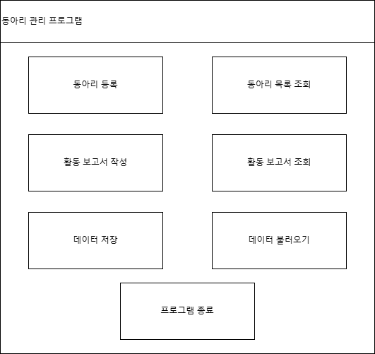

# 동아리 관리 프로그램

## 1. 개요
### 1.1 목적
동아리 정보를 체계적으로 관리하고 활동 보고서를 작성하여 대학 내 동아리 운영을 지원합니다.

### 1.2 대상
- 청주대 동아리 운영진
- 청주대 지도교수
- 청주대 학생지원팀

## 2. 프로그램의 중요성 및 필요성
### 2.1 중요성
- 동아리 운영의 투명성과 효율성 향상
- 활동 내역 기록 자동화
- 동아리별 보고서 통계를 활용한 데이터 기반 의사결정 지원

### 2.2 필요성
- 데이터 손실 방지 및 안정적인 기록 유지
- 동아리 활동 평가 및 지원 업무 간소화
- 검색 및 통계 기능을 통해 동아리 성과 분석 가능

## 3. 프로그램 수행 절차
### 3.1 다이어그램
- 

### 3.2 클래스 다이어그램
- 

### 3.3 절차 설명
1. **프로그램 실행**
    - GUI 인터페이스
2. **메인 메뉴 표시**
    - 동아리 등록
    - 동아리 목록 조회
    - 활동 보고서 작성
    - 활동 보고서 조회
    - 활동 보고서 검색
    - 보고서 통계 보기
    - 데이터 저장
    - 데이터 불러오기
    - 프로그램 종료
3. **선택한 작업 실행 후 메인 메뉴로 복귀**
4. **프로그램 종료**

### 3.4 GUI 구성 이미지
- 

## 4. 느낀점

### 4.1 체계적인 계획의 중요성

- 처음에 프로그램을 설계하고 구현할 때는 전체적인 구조가 머릿속에서 복잡하게 얽혀 있었습니다. GUI, 데이터 관리, 파일 입출력, 컬렉션 프레임워크, 예외 처리 등 다양한 요소를 동시에 고려해야 했기 때문에 막연히 어렵고 복잡하다는 생각이 들었습니다. 하지만 계획과 체계적인 설계 과정을 통해 문제를 단계적으로 해결할 수 있었습니다.
- 프로그램을 모듈화하여 각 기능을 독립적으로 설계한 덕분에 구현 과정이 한결 수월해졌습니다. 예를 들어, 동아리 관리와 활동 보고서 관리를 각각 ClubManager 클래스와 ActivityReport 클래스로 분리하여 구현하니, 서로 다른 로직을 명확하게 구분할 수 있었습니다.
- 클래스 다이어그램과 흐름도를 먼저 작성한 것이 큰 도움이 되었습니다. 구현에 앞서 프로그램의 구조와 동작 흐름을 시각화하니, 막연했던 작업들이 점차 구체화되었고, 효율적으로 코드를 작성할 수 있었습니다.
- 복잡한 기능을 작은 단위로 나누어 구현하면서, 하나의 기능에 집중할 수 있었습니다. 예를 들어 >>
    - 동아리 등록 기능을 먼저 구현한 후, 이를 기반으로 동아리 조회 기능을 추가
    - 이후 활동 보고서 작성 기능을 구현하고, 보고서 조회 및 검색 기능으로 확장
- 이러한 단계적인 접근 방식 덕분에 점진적으로 프로그램의 복잡도를 줄이고, 각 단계에서 발생하는 문제를 해결할 수 있었습니다.
- 프로젝트 시작 전 입출력, 컬렉션 프레임워크, 예외 처리, GUI와의 연동 등 예상되는 문제를 미리 파악하고, 각 기능이 어떻게 작동해야 하는지 세부적으로 계획한 덕분에 실제 구현 과정이 훨씬 쉬워졌습니다.
- 예를 들어 파일 입출력을 위해 데이터를 직렬화하고, GUI와의 연동을 위해 데이터를 문자열로 변환하는 메서드를 미리 설계한 덕분에 코드가 중복되지 않고 유지보수가 쉬워졌습니다.

### 4.2 구현 과정에서의 성취감

- 처음에는 GUI 설계와 데이터 관리 로직이 동시에 작동하는 프로그램을 만드는 것이 어려워 보였지만, 계획한 대로 차근차근 구현하니 최종적으로 동작하는 프로그램을 완성했을 때 큰 성취감을 느꼈습니다.
- 특히, GUI에서 사용자가 동아리 정보를 입력하고, 그 데이터를 ClubManager에 저장하는 흐름이 원활히 작동할 때, 프로그램 설계와 구현이 연결되는 순간을 실감할 수 있었습니다.
- 활동 보고서 검색 기능을 구현할 때, 키워드와 날짜 기반 검색을 위해 데이터를 효율적으로 관리하는 구조를 설계하는 데 어려움이 있었지만, 이를 해결하면서 데이터 구조 설계 능력이 향상되었습니다.
- 처음에는 단순히 리스트로 데이터를 관리했으나, HashMap을 활용해 동아리별로 보고서를 구분하고, 검색 속도를 개선하는 방향으로 다시 설계한 경험이 큰 성장을 가져다주었습니다.

### 4.3 느낀 점과 결론

- 막상 구현을 시작하기 전에는 프로그램 구현이 복잡했지만, 계획적으로 문제를 나누고 체계적으로 설계한 덕분에 훨씬 쉽게 구현할 수 있었습니다.
- 프로젝트를 진행하면서 느낀 가장 큰 교훈은 "모든 복잡한 문제는 작은 단계로 나누면 해결할 수 있다"는 점이었습니다. 앞으로도 큰 프로젝트를 진행할 때 체계적인 설계와 단계적인 접근 방식을 지속적으로 활용하고자 합니다.

## 5. 개발 기록 (Changelog)
### 현재 버전
- **v2.0.0 - 2024-12-25**
    - **ClubManager 클래스 업데이트**:
        - 보고서 데이터 구조를 'HashMap'으로 변경하여 검색 및 분류 기능 강화
    - **ClubManagementGUI 클래스 업데이트**:
        - GUI에 보고서 통계 버튼 추가
    - 모든 클래스 호환 점검 및 수정

### 이전 변경 사항
- **2024-12-24 (v1.8.0)**:
    - **ClubManagementGUI 클래스 업데이트**:
        - 보고서 통계 기능 추가
        - 특정 기간 내 보고서 수, 특정 동아리의 보고서 수 통계 제공
        - 버튼 레이아웃에 보고서 통계 버튼 추가 및 이벤트 연동
    - **ClubManager 클래스 업데이트**:
        - 보고서 통계 및 특정 기간 검색 기능 추가

- **2024-12-22 (v1.7.1)**:
    - **ActivityReport 클래스 업데이트**:
        - 작성자, 활동 위치, 활동 결과 필드 추가
        - 보고서 세부 정보를 반환하는 getReportDetails 메서드 개선
    
- **2024-12-21 (v1.7.0)**:
    - **ClubManager 클래스 업데이트**:
        - 활동 보고서 검색 기능 추가
        - 키워드 및 날짜 기반 검색 지원
        - 검색 결과 포맷팅 기능 추가

- **2024-12-20 (v1.6.1)**:
    - **ClubManager 클래스 업데이트**:
        - 파일 입출력 예외 처리 강화

- **2024-12-19 (v1.6.0)**:
    - **ClubManagementGUI 클래스 업데이트**:
        - GridBagLayout을 활용하여 GUI 버튼 배치 변경
        - 버튼 간 여백 조정 및 사용자 편의성 개선
    - **ClubManager 클래스 업데이트**:
        - GUI 배치 변경에 따른 데이터 연동

- **2024-12-18 (v1.5.2)**:
    - **ClubManagementGUI 클래스 업데이트**:
        - 활동 보고서 작성과 조회 버튼 추가로 GUI 기능 개선
        - 활동보고서 사용자 입력 및 출력 지원
    - **ClubManager 클래스 업데이트**:
        -등록된 활동 보고서를 문자열로 반환하는 매서드 추가

- **2024-12-16 (v1.5.1)**:
    - **ClubManagementGUI 클래스 업데이트**:
        - 프로그램 종료 버튼 추가로 GUI 기능 개선
        - 프로그램 종료 시 System.exit(0) 기능 구현

- **2024-12-15 (v1.5.0)**:
    - **ClubManagementGUI 클래스 추가**:
        - Swing 기반 GUI 도입으로 동아리 관리 작업 수행 가능
        - 동아리 등록, 목록 조회, 데이터 저장/불러오기 기능 GUI 구현
        - 사용자 입력 및 출력 지원
    - **ClubManager 클래스 업데이트**:
        - GUI 연동을 위해 동아리 데이터를 문자열로 반환하는 메서드 추가
        - Swing GUI 연동을 통해 데이터 저장/불러오기 기능 강화
        - 데이터 직렬화 및 예외 처리 안정성 개선
    - **Main 클래스 업데이트**:
        - SwingUtilities를 사용한 GUI 프로그램 실행 지원
        - 기존 콘솔 기반 로직과 GUI를 통합하여 동작하도록 변경
        - 프로그램 시작/종료 시 데이터 자동 저장/불러오기 로직 개선

- **2024-12-08 (v1.4.0)**:
    - **ClubManager 클래스 업데이트**:
        - 동아리 및 활동 보고서 데이터를 파일로 저장/불러오기 위한 메서드 구현
        - 데이터 저장 시 파일 입출력 방식 사용
        - 데이터 불러오기 시 예외 처리 추가
        - 프로그램 시작 시 자동으로 데이터 불러오고, 종료 시 자동으로 데이터 저장 기능 구현
    - **Club 클래스 업데이트**:
        - 파일 입출력을 위한 인터페이스 구현
        - 직렬화 안정성 보장

- **2024-12-07 (v1.3.0)**:
    - **ClubManager 클래스**:
        - 동아리와 활동 보고서를 관리하기 위한 리스트 속성 추가
        - 동아리 등록, 조회, 활동 보고서 작성, 조회 기능 개선
        - 리스트 출력 로직 추가
    - **ActivityReport 클래스**:
        - 활동 보고서 세부 정보 반환 기능 구현

- **2024-12-06 (v1.2.0)**:
    - **Club 클래스와 ActivityReport 클래스**:
        - 큰 틀 작성 및 초기 설계 완료
    - **구조 설계**:
        - 프로그램의 확장 가능성을 고려한 구조 설계

- **2024-12-05 (v1.1.0)**:
    - **Main 클래스**:
        - 프로그램 구조화 및 초기 틀 구현 완료
        - 동아리 등록, 조회, 활동 보고서 작성, 조회 기능의 초안 작성

- **2024-12-04 (v1.0.0)**:
    - 프로젝트 초기 생성
    - 기본적인 구조 설계
    - **ClubManager 클래스**:
        - 동아리 관리 기능 초안 작성