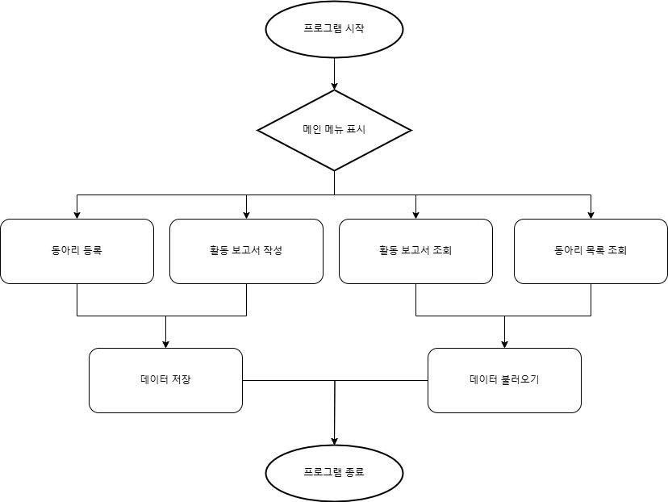
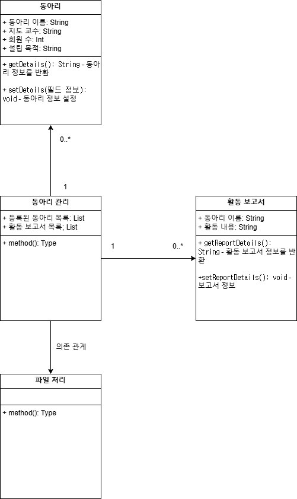

# 동아리 관리 프로그램

## 1. 개요
### 1.1 목적
동아리 정보를 체계적으로 관리하고 활동 보고서를 작성하여 대학 내 동아리 운영을 지원합니다.

### 1.2 대상
- 청주대 동아리 운영진
- 청주대 지도교수
- 청주대 학생지원팀

## 2. 프로그램의 중요성 및 필요성
### 2.1 중요성
- 동아리 운영의 투명성과 효율성 향상.
- 활동 내역 기록 자동화.

### 2.2 필요성
- 데이터 손실 방지.
- 동아리 활동 평가 및 지원 간소화.

## 3. 프로그램 수행 절차
### 3.1 다이어그램
- 

### 3.2 클래스 다이어그램
- 

### 3.3 절차 설명
1. 프로그램 실행
2. 메인 메뉴 표시
    - 동아리 등록
    - 동아리 목록 조회
    - 활동 보고서 작성
    - 활동 보고서 조회
    - 데이터 저장
    - 데이터 불러오기
    - 프로그램 종료
3. 선택한 작업 실행 후 메인 메뉴로 복귀
4. 프로그램 종료

## 4. 느낀점

## 5. 개발 기록 (Changelog)
### 현재 버전
**v1.5.0 - 2024-12-15**
- **ClubManagementGUI 클래스 추가**:
    - Swing 기반 GUI 도입으로 동아리 관리 작업 수행 가능
    - 동아리 등록, 목록 조회, 데이터 저장/불러오기 기능 GUI 구현
    - 사용자 입력 및 출력 지원
- **ClubManager 클래스 업데이트**:
    - GUI 연동을 위해 동아리 데이터를 문자열로 반환하는 메서드 추가
    - Swing GUI 연동을 통해 데이터 저장/불러오기 기능 강화
    - 데이터 직렬화 및 예외 처리 안정성 개선
- **Main 클래스 업데이트**:
    - SwingUtilities를 사용한 GUI 프로그램 실행 지원
    - 기존 콘솔 기반 로직과 GUI를 통합하여 동작하도록 변경
    - 프로그램 시작/종료 시 데이터 자동 저장/불러오기 로직 개선

### 이전 변경 사항
- **2024-12-08 (v1.4.0)**:
  - **ClubManager 클래스 업데이트**:
      - 동아리 및 활동 보고서 데이터를 파일로 저장/불러오기 위한 메서드 구현
      - 데이터 저장 시 파일 입출력 방식 사용
      - 데이터 불러오기 시 예외 처리 추가
      - 프로그램 시작 시 자동으로 데이터 불러오고, 종료 시 자동으로 데이터 저장 기능 구현
  - **Club 클래스 업데이트**:
      - 파일 입출력을 위한 인터페이스 구현
      - 직렬화 안정성 보장
  
- **2024-12-07 (v1.3.0)**:
    - **ClubManager 클래스**:
        - 동아리와 활동 보고서를 관리하기 위한 리스트 속성 추가
        - 동아리 등록, 조회, 활동 보고서 작성, 조회 기능 개선
        - 리스트 출력 로직 추가
    - **ActivityReport 클래스**:
        - 활동 보고서 세부 정보 반환 기능 구현

- **2024-12-06 (v1.2.0)**:
    - **Club 클래스와 ActivityReport 클래스**:
        - 큰 틀 작성 및 초기 설계 완료
    - **구조 설계**:
        - 프로그램의 확장 가능성을 고려한 구조 설계

- **2024-12-05 (v1.1.0)**:
    - **Main 클래스**:
        - 프로그램 구조화 및 초기 틀 구현 완료
        - 동아리 등록, 조회, 활동 보고서 작성, 조회 기능의 초안 작성

- **2024-12-04 (v1.0.0)**:
    - 프로젝트 초기 생성
    - 기본적인 구조 설계
    - **ClubManager 클래스**:
        - 동아리 관리 기능 초안 작성